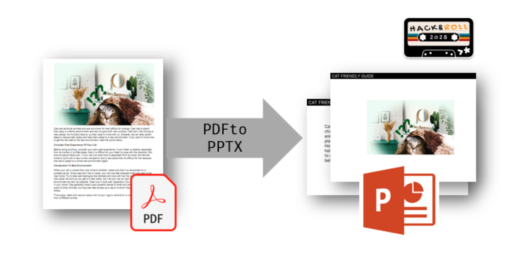
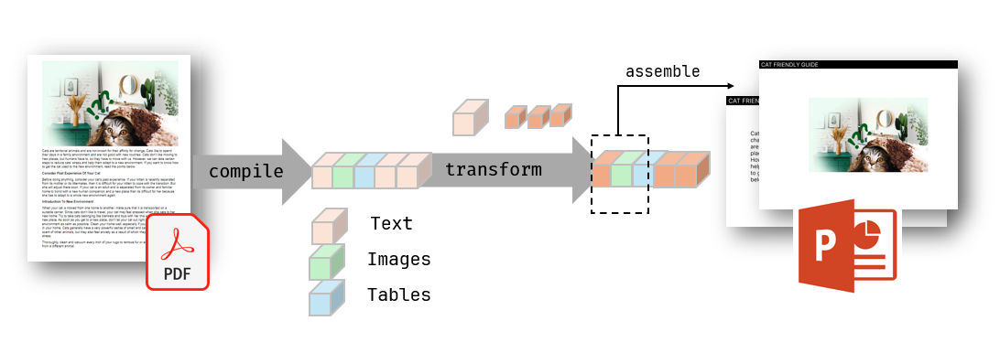

# PDFtoPPTX - A Responsive PDF to PPTX convertor

PDFtoPPTX is a Python tool that converts PDF documents into editable PowerPoint presentations while readjusting layout, text, images, and tables to be easy to reconfigure. It intelligently analyzes PDF content and creates well-formatted PPTX slides.



## Installation
```bash
# to be updated
```

## Example Usage
```python
convert("input.pdf", "output.pptx", 
    title = "CAT FRIENDLY GUIDE", 
    subtitle = "Make Your Cat Get Used To A New Environment", 
    paragraphFontSize = 18,
    fontFamily = "Calibri",
    maxWordPerPageDefault = 70,
    maxWordPerPageWithImage = 30,
    ignoreTop = 0,
    ignoreBottom = 0)
```

## Under the hood


Unlike any traditional `pdf2pptx` libraries that treat every single page as images, this library metriculously compiles the texts, images, and table components and saves them as objects. The program then attempts to prettify and optimize the number of slides by chopping long texts and merging unnecessary cross-page text segments. Finally, the processed objects are assembled into a format that closely resembles a human-editable PowerPoint presentation.


## Remarks


## Acknowledgement
This project has been created at [NUS Hack&Roll 2025](https://hacknroll.nushackers.org/) under 24-hours constraint. 